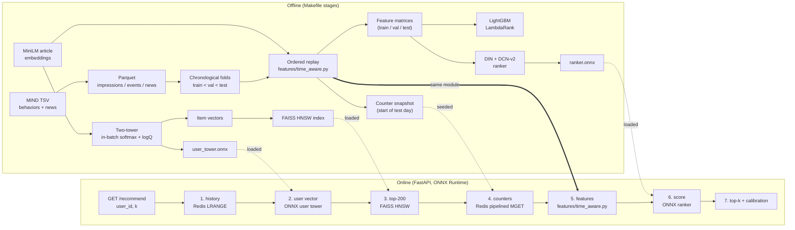

# news-recsys

A two-stage news recommender on [MIND](https://msnews.github.io/): two-tower retrieval
over a FAISS HNSW index, then a DIN + DCN-v2 ranker, served behind FastAPI with ONNX
Runtime and Redis - with the offline evaluation and the serving latency measured rather
than asserted.

Headline numbers on the sealed MIND-small test split (the official `dev`
split, scored once): ranker AUC **TBD**, nDCG@10
**TBD**; LightGBM LambdaRank baseline AUC
**0.7017**. The online feature path is verified to reproduce the
offline one bit for bit.

> Every number in this file is produced by a script in this repo and stored under
> `results/`; this README is generated from those JSON files by
> `scripts/build_readme.py`. Anything not yet measured says **TBD**.

## Architecture



The box marked *same module* is the point of the design: `features/time_aware.py` is
imported by both the offline replay and the request path, so there is exactly one
implementation of every feature.

## Data

| fold | impressions | labelled rows | clicks | users | distinct articles | window |
|---|---:|---:|---:|---:|---:|---|
| train | 126,695 | 4,621,015 | 189,519 | 46,012 | 16,978 | 2019-11-09 .. 2019-11-13 |
| val | 30,270 | 1,222,429 | 46,825 | 20,179 | 6,144 | 2019-11-14 .. 2019-11-14 |
| test | 73,152 | 2,740,998 | 111,383 | 50,000 | 5,369 | 2019-11-15 .. 2019-11-15 |

65,238 articles across 18 categories and
270 subcategories. Split policy: test = MIND-small dev split (sealed); val = last calendar day of MIND-small train; train = everything earlier. No random splits.

Two measurements drove most of the modelling decisions:

* **71.0% of test articles never appear in a
  training impression** - 80.6% of test rows and
  86.8% of test clicks. Article-ID embeddings would
  be guessing on most of the test set, so articles are represented by their text.
* **88.9% of test users never
  appear in training** - MIND-small samples a different 50,000 users per split (only
  5,943 of 50,000 overlap). User-ID
  embeddings are therefore useless; the user tower reads the click history that arrives
  with the request.


## Offline results

| model | AUC | MRR | nDCG@5 | nDCG@10 | log loss | ECE |
|---|---:|---:|---:|---:|---:|---:|
| time-aware popularity | 0.6499 | 0.3103 | 0.3386 | 0.4007 | 0.1575 | 0.0102 |
| LightGBM LambdaRank | 0.7017 | 0.3505 | 0.3902 | 0.4500 | 0.1542 | 0.0069 |
| DIN + DCN-v2 ranker | TBD | TBD | TBD | TBD | TBD | TBD |

Scored with MIND's protocol: one metric per impression, averaged over impressions.
95% bootstrap CI over impressions for the LambdaRank AUC: [0.6998, 0.7039].


### Cold start

| model | AUC (clicked article unseen in train) | AUC (clicked article seen in train) | nDCG@10 unseen | nDCG@10 seen |
|---|---:|---:|---:|---:|
| time-aware popularity | 0.6735 | 0.4270 | 0.4111 | 0.3022 |
| LightGBM LambdaRank | 0.7159 | 0.5673 | 0.4558 | 0.3958 |

80.6% of test rows and 90.4% of
test impressions involve an article the training fold never showed
(66,149 cold impressions vs 7,003 warm ones, where "cold" means the article
the user actually clicked was unseen in training).

**The usual cold-start intuition is inverted here.** Every model scores *higher* on the
cold slice than on the warm one. On a news feed the clicked article is nearly always a
fresh one, so "the user clicked something that was already around during training" is the
unusual, hard-to-predict event - and freshness features actively rank those articles down.
The weakness of this system is stale-but-clicked articles, not new ones.

A second, stricter definition - the article had never been shown to *anyone* before the
request - covers only 0.1% of test rows, because an article that
goes live at 00:05 is already warm by 09:00. Both are reported in
`results/metrics/*.json` so the two are never confused.


### Calibration

Calibration: TBD


## Retrieval

Retrieval results: TBD


## Serving

Training/serving skew check: TBD

ONNX export report: TBD

Redis seed report: TBD


## Load test

Load test: TBD


## Diversity re-ranking (stretch)

MMR diversity trade-off: TBD


## Published comparisons

All numbers are percentages on the MIND-small `dev` split.

| model | AUC | MRR | nDCG@5 | nDCG@10 | source |
|---|---:|---:|---:|---:|---|
| NAML | 66.12 | 31.53 | 34.88 | 41.09 | [2210.05196](https://arxiv.org/abs/2210.05196) |
| LSTUR | 65.87 | 30.78 | 33.95 | 40.15 | [2210.05196](https://arxiv.org/abs/2210.05196) |
| NRMS | 65.63 | 30.96 | 34.13 | 40.52 | [2210.05196](https://arxiv.org/abs/2210.05196) |
| DIGAT | 68.77 | 33.46 | 37.14 | 43.39 | [2210.05196](https://arxiv.org/abs/2210.05196) |
| BERT-NRMS | 68.60 | 32.97 | 36.55 | 42.78 | [2409.17711](https://arxiv.org/abs/2409.17711) |
| Prompt4NR | 68.48 | 33.29 | 37.12 | 43.25 | [2409.17711](https://arxiv.org/abs/2409.17711) |
| UniTRec | 68.59 | 33.76 | 37.63 | 43.74 | [2409.17711](https://arxiv.org/abs/2409.17711) |
| **this repo: LightGBM LambdaRank** | 70.17 | 35.05 | 39.02 | 45.00 | measured here |
| **this repo: DIN + DCN-v2** | TBD | TBD | TBD | TBD | measured here |

**Read this table with the caveats, not without them:**

* Published numbers are transcribed from the cited tables, not reproduced here.
* Both sources evaluate on MIND-small dev; one states the evaluation set has 73,152 impressions, matching this repo's sealed test fold exactly.
* Those models train on all of MIND-small train; this repo holds out its last calendar day for validation and therefore trains on less data.
* Those models are content-only neural rankers. The models here also use time-aware popularity/CTR counters computed causally from earlier events - a different information set, which is the most likely explanation for any gap in either direction.

The honest summary: the models here are ahead on this split, and the most likely reason is
the time-aware counter features rather than the architecture - those are legitimate,
causally computed, and available online, but they are information the cited content-only
models do not use. A like-for-like architecture comparison would need those features
removed, which is a one-line ablation this repo has not run.


## Reproducing

```bash
uv sync --extra dev                 # install (Python 3.11)
cp .env.example .env                # add a Hugging Face token with MIND access
make m1                             # download, parse, fold, dataset stats
make m2                             # embeddings, shared features, baselines
make m3                             # two-tower, FAISS index, recall/latency
make m4                             # DIN + DCN-v2 ranker
make m5                             # ONNX export, redis, seed the feature store
make serve                          # run the API (separate shell)
make skew                           # assert online features == offline features
make m6                             # locust ladder, latency vs QPS
make m7                             # MMR diversity trade-off
make readme                         # regenerate this file from results/
```

The MIND dataset is gated: accept the licence at
<https://huggingface.co/datasets/yjw1029/MIND> and put a read token in `.env` as
`NEWSREC_HF_TOKEN`. Raw data is never committed.

CI runs lint, types, unit tests and an end-to-end smoke test of the whole pipeline on a
synthetic MIND-format dataset (`make smoke`), so no licensed data is needed to verify the
code path.

## Timings on the measurement machine

| stage | wall clock |
|---|---:|
| article embeddings (65,238 articles, CPU) | 903 s |
| feature replay (4,621,015 train rows) | 242 s |
| LightGBM LambdaRank | 56 s |
| two-tower (3 epochs) | 795 s |
| DIN + DCN-v2 ranker (? cross layers) | TBD s |

Machine: 12th Gen Intel(R) Core(TM) i5-1235U, 10 physical /
12 logical cores, 31.7 GB RAM,
none (CPU-only measurements). Python 3.11.15,
torch 2.14.0+cpu,
onnxruntime 1.30.0,
faiss 1.15.1.

## Licence

MIT (see `LICENSE`). The MIND dataset is licensed separately by Microsoft Research and is
not redistributed here.

<sub>Generated by `scripts/build_readme.py` on 2026-09-20.</sub>
