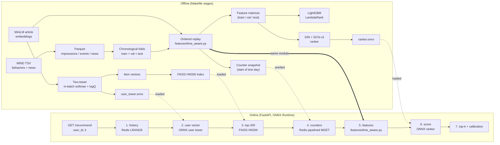
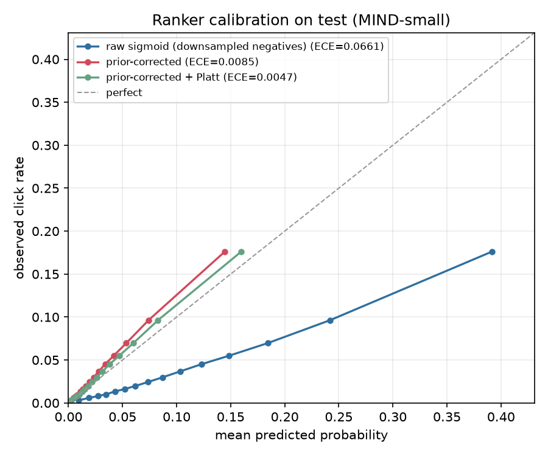
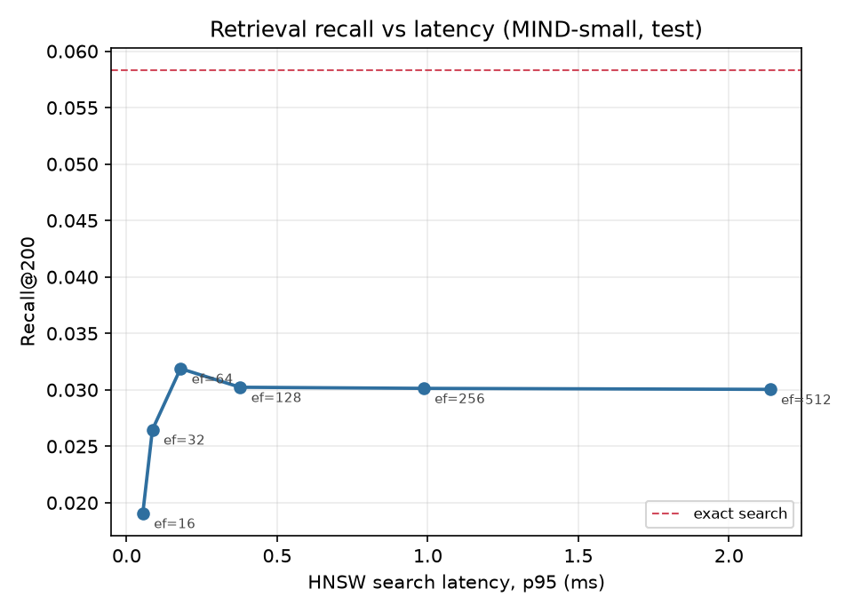
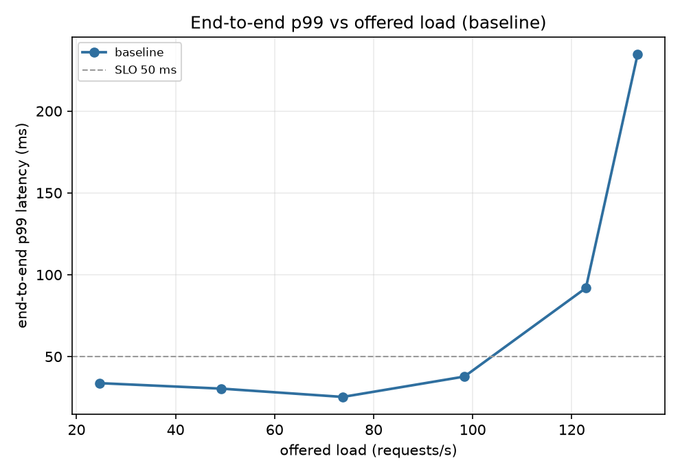
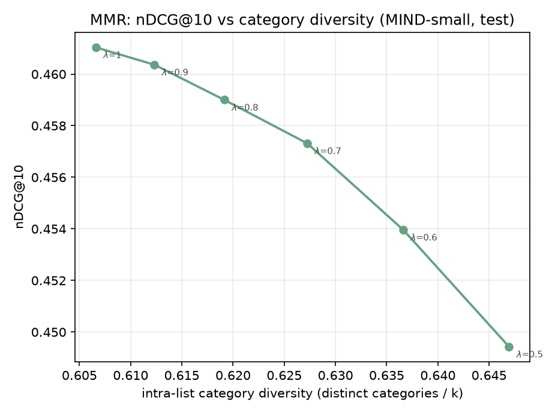

# news-recsys

A two-stage news recommender on [MIND](https://msnews.github.io/): two-tower retrieval
over a FAISS HNSW index, then a DIN + DCN-v2 ranker, served behind FastAPI with ONNX
Runtime and Redis - with the offline evaluation and the serving latency measured rather
than asserted.

Headline numbers on the sealed MIND-small test split (the official `dev`
split, scored once): ranker AUC **0.7144**, nDCG@10
**0.4610**; LightGBM LambdaRank baseline AUC
**0.7017**. The online feature path is verified to reproduce the
offline one bit for bit.

> Every number in this file is produced by a script in this repo and stored under
> `results/`; this README is generated from those JSON files by
> `scripts/build_readme.py`. Anything not yet measured says **TBD**.

## Architecture



The box marked *same module* is the point of the design: `features/time_aware.py` is
imported by both the offline replay and the request path, so there is exactly one
implementation of every feature.

## Data

| fold | impressions | labelled rows | clicks | users | distinct articles | window |
|---|---:|---:|---:|---:|---:|---|
| train | 126,695 | 4,621,015 | 189,519 | 46,012 | 16,978 | 2019-11-09 .. 2019-11-13 |
| val | 30,270 | 1,222,429 | 46,825 | 20,179 | 6,144 | 2019-11-14 .. 2019-11-14 |
| test | 73,152 | 2,740,998 | 111,383 | 50,000 | 5,369 | 2019-11-15 .. 2019-11-15 |

65,238 articles across 18 categories and
270 subcategories. Split policy: test = MIND-small dev split (sealed); val = last calendar day of MIND-small train; train = everything earlier. No random splits.

Two measurements drove most of the modelling decisions:

* **71.0% of test articles never appear in a
  training impression** - 80.6% of test rows and
  86.8% of test clicks. Article-ID embeddings would
  be guessing on most of the test set, so articles are represented by their text.
* **88.9% of test users never
  appear in training** - MIND-small samples a different 50,000 users per split (only
  5,943 of 50,000 overlap). User-ID
  embeddings are therefore useless; the user tower reads the click history that arrives
  with the request.


## Offline results

| model | AUC | MRR | nDCG@5 | nDCG@10 | log loss | ECE |
|---|---:|---:|---:|---:|---:|---:|
| time-aware popularity | 0.6499 | 0.3103 | 0.3386 | 0.4007 | 0.1575 | 0.0102 |
| LightGBM LambdaRank | 0.7017 | 0.3505 | 0.3902 | 0.4500 | 0.1542 | 0.0069 |
| DIN + DCN-v2 ranker | 0.7144 | 0.3597 | 0.3987 | 0.4610 | 0.1496 | 0.0047 |

Scored with MIND's protocol: one metric per impression, averaged over impressions.
95% bootstrap CI over impressions for the LambdaRank AUC: [0.6998, 0.7039].


### Cold start

| model | AUC (clicked article unseen in train) | AUC (clicked article seen in train) | nDCG@10 unseen | nDCG@10 seen |
|---|---:|---:|---:|---:|
| time-aware popularity | 0.6735 | 0.4270 | 0.4111 | 0.3022 |
| LightGBM LambdaRank | 0.7159 | 0.5673 | 0.4558 | 0.3958 |
| DIN + DCN-v2 | 0.7232 | 0.6321 | 0.4642 | 0.4315 |

80.6% of test rows and 90.4% of
test impressions involve an article the training fold never showed
(66,149 cold impressions vs 7,003 warm ones, where "cold" means the article
the user actually clicked was unseen in training).

**The usual cold-start intuition is inverted here.** Every model scores *higher* on the
cold slice than on the warm one. On a news feed the clicked article is nearly always a
fresh one, so "the user clicked something that was already around during training" is the
unusual, hard-to-predict event - and freshness features actively rank those articles down.
The weakness of this system is stale-but-clicked articles, not new ones.

A second, stricter definition - the article had never been shown to *anyone* before the
request - covers only 0.1% of test rows, because an article that
goes live at 00:05 is already warm by 09:00. Both are reported in
`results/metrics/*.json` so the two are never confused.


### Calibration

Negatives are downsampled to 0.25 of the shown-not-clicked rows during
ranker training, which inflates every predicted probability. The fix is a closed-form
shift of the logit by `log(keep_rate)`; the table shows it working.

| probability estimate | log loss | Brier | ECE | mean predicted | observed |
|---|---:|---:|---:|---:|---:|
| raw sigmoid (trained on downsampled negatives) | 0.1815 | 0.0443 | 0.06608 | 0.1067 | 0.0406 |
| closed-form prior correction | 0.1504 | 0.0370 | 0.00846 | 0.0322 | 0.0406 |
| prior correction + Platt (fitted on val) | 0.1496 | 0.0369 | 0.00467 | 0.0360 | 0.0406 |




## Retrieval

| retriever / pool | Recall@10 | Recall@50 | Recall@100 | Recall@200 | Recall@500 |
|---|---:|---:|---:|---:|---:|
| two-tower, full catalogue (65,238 articles) | 0.0016 | 0.0105 | 0.0179 | 0.0300 | 0.0583 |
| two-tower, live pool (6,144), reachable clicks only | 0.0083 | 0.0448 | 0.0785 | 0.1339 | 0.2581 |
| most-popular-now, live pool | 0.0649 | 0.1206 | 0.2166 | 0.3740 | 0.4122 |

**The learned tower is not the best retriever here, and the repo ships the measured answer
rather than the intended one.** A user-independent "most popular in the last 24h" list
retrieves the clicked article about 12x more often than the two-tower does: news clicks are
head-heavy and freshness-driven, and a content-only tower has no notion of recency, so it
returns articles that are *about* the right thing and days old. The serving path therefore
blends both sources and lets the ranker - which does have recency and CTR features - sort
the union.

Two caveats belong with that number. The tower was still improving when training stopped at
6 CPU epochs. And recall measured against *logged* clicks rewards a retriever for
re-finding what the previous production system already showed, so it structurally
under-credits personalised retrieval; the mix below is treated as a product decision, not
as something to maximise offline.

Blending both sources at a fixed budget of 200 candidates (the ranker's cost is the budget, so the question is the mix, not the winner):

| candidates from the trending list | Recall of the clicked article |
|---:|---:|
| 0 | 0.0300 |
| 25 | 0.1038 |
| 50 | 0.1402 |
| 100 | 0.2306 |
| 150 | 0.3467 |
| all | 0.3740 |

**Index freshness is the binding constraint, not the model.** Only
75.1% of test clicks are on articles that an index built at the
start of the test day would even contain; the rest are articles that appeared during the
day. That ceiling, not the tower, is what caps the full-catalogue recall - which is why
the live-pool row is reported conditioned on reachability.

HNSW sweep (single-query latency, 1 thread, k=200):

| efSearch | Recall@200 | overlap@100 vs exact | p50 (ms) | p95 (ms) | p99 (ms) |
|---:|---:|---:|---:|---:|---:|
| 16 | 0.0191 | 0.6637 | 0.035 | 0.054 | 0.083 |
| 32 | 0.0265 | 0.8333 | 0.059 | 0.086 | 0.155 |
| 64 | 0.0319 | 0.9458 | 0.142 | 0.179 | 0.237 |
| 128 | 0.0302 | 0.9858 | 0.220 | 0.377 | 0.620 |
| 256 | 0.0301 | 0.9959 | 0.486 | 0.986 | 1.214 |
| 512 | 0.0300 | 0.9984 | 1.189 | 2.136 | 2.603 |

Selected on validation: **efSearch = 32**
(smallest p95 latency whose val recall@200 is within 1% of exact search).




### Retrieval from a fresh pool

Before reading anything into a low recall, the boring explanation was ruled out: trained on a 512-click subset with regularisation off, the tower reaches **Recall@1 0.8906 and Recall@10 0.9922** on those same clicks against the full 65,238-article catalogue, where chance Recall@10 is 0.015%. The architecture, loss and index plumbing are sound, so what follows is a generalisation result, not a bug report (`scripts/sanity_overfit.py`).

The Recall@K above searches the whole catalogue, most of which is stale by the test day.
A news system never does that: it retrieves from what is currently circulating. So the pool
is rebuilt **per impression** - the articles with at least one impression in the preceding
window, judged only from events earlier than the impression being scored - and all three
retrievers are re-scored inside it (111,383 clicks over
73,152 impressions, `scripts/eval_retrieval_fresh.py`).

| pool | mean pool size | clicks reachable | two-tower R@50 | trending R@50 | blend R@50 | two-tower R@200 | trending R@200 | blend R@200 |
|---|---:|---:|---:|---:|---:|---:|---:|---:|
| full catalogue | 65,238 | 100.0% | 0.0105 | 0.5285 | 0.4203 | 0.0300 | 0.7322 | 0.6614 |
| fresh, 24 h window | 5,946 | 99.9% | 0.0459 | 0.5285 | 0.4277 | 0.1330 | 0.7322 | 0.6862 |
| fresh, 48 h window | 9,570 | 99.9% | 0.0276 | 0.5285 | 0.4235 | 0.0959 | 0.7322 | 0.6746 |

Four things fall out of this table:

1. **A fresh pool is worth 4.4x to the two-tower** (Recall@200
   0.0300 -> 0.1330,
   a 4.4x gain), and the 48-hour window sits between the two - the tighter the
   pool, the less stale competition. Most of the tower's apparent failure was retrieving
   articles that were topically reasonable and days old.
2. **Trending does not move at all** (0.7322 under every
   pool). Its score is a freshness prior already, so restricting the pool removes nothing
   from its top-200. That is the cleanest evidence that the pool restriction is doing what
   it claims and not just shrinking the denominator.
3. **The freshness ceiling reported earlier was an artefact of a static index.** With a
   rolling window, 99.9% of clicked articles are reachable -
   against 75.1% for an index built once at the start of the test day. Both numbers are
   real, and together they price the difference: continuous indexing is worth ~25 points of
   reachable recall, which is far more than any modelling change here.
4. **The blend still costs recall** (0.6862 vs
   0.7322 for trending alone under the same pool).
   Giving half the budget to the tower buys personalised candidates and pays about 4.6
   points of Recall@200 for them.

**No retrain was triggered by this.** The tower improves 4.4x and is still 5.5x behind
trending inside the same fresh pool; the sanity check says the model fits data fine, so the
gap is training budget and capacity, not a pool-selection artefact. A few more CPU epochs
will not close 5.5x, so the honest next step is a GPU run with harder in-pool negatives -
not a tweak justified by this experiment.


## Serving

`scripts/check_skew.py` compared **5,426 rows x 35 features = 189,910 values** between the running server and the offline replay over 200 sampled test impressions: **identical** (max |difference| 0.0e+00).

ONNX exports agree with PyTorch to 1.8e-07 (user tower) and 1.7e-06 (ranker).

Redis holds 20,288 article counter rows, 50,000 user rows and 50,000 click histories (30.3 MB, 119,170 keys).


## Load test

Hardware: 12th Gen Intel(R) Core(TM) i5-1235U, 10 physical / 12 logical cores, 31.7 GB RAM, none (CPU-only measurements).
Offered load is **open loop** - arrivals follow a fixed timetable, so a slow server gets a growing queue instead of a quietly reduced load. 60s per rung, k=10.

Each run records a sequential **calibration anchor** before and after the ladder (13.9 ms -> 14.1 ms here), because this 15 W laptop measurably slows down after hours of sustained work: the same probe read 15.0 ms cold and 42.5 ms after an afternoon of training runs. Absolute QPS on this box is only meaningful with the anchor attached; the configuration *comparison* below is not.

**Sustained 98.3 QPS with p99 under 50 ms** in the baseline configuration, rising to **98.3 QPS** with half the candidate set.

| offered | achieved QPS | p50 (ms) | p95 (ms) | p99 (ms) | server p50 (ms) |
|---:|---:|---:|---:|---:|---:|
| 25.0 | 24.6 | 14.8 | 26.6 | 33.8 | 12.0 |
| 50.0 | 49.2 | 14.1 | 19.1 | 30.4 | 11.4 |
| 75.0 | 73.8 | 14.2 | 17.3 | 25.4 | 11.1 |
| 100.0 | 98.3 | 15.5 | 22.8 | 37.8 | 12.0 |
| 125.0 | 122.9 | 22.7 | 44.2 | 91.9 | 17.4 |
| 150.0 | 133.3 | 174.0 | 211.9 | 234.7 | 36.7 |

Where the time goes, measured inside the server at 49 QPS:

| stage | p50 (ms) | p95 (ms) | p99 (ms) |
|---|---:|---:|---:|
| history_fetch | 1.35 | 1.92 | 2.70 |
| user_embedding | 0.68 | 1.02 | 1.40 |
| retrieval | 0.31 | 0.42 | 0.65 |
| counter_fetch | 2.69 | 3.72 | 5.01 |
| feature_build | 0.74 | 1.17 | 1.67 |
| ranking | 5.30 | 7.96 | 11.69 |
| postprocess | 0.15 | 0.22 | 0.32 |

### Before and after tuning

| configuration | sustained QPS at p99 <= 50 ms | p50 at 50 QPS (ms) | ranking stage p50 (ms) | user-embedding stage p50 (ms) |
|---|---:|---:|---:|---:|
| baseline (200 candidates, no cache, 2 ORT threads) | 98.3 | 14.1 | 5.30 | 0.68 |
| + user-embedding cache | 98.3 | 14.5 | 5.61 | 0.09 |
| + 100 candidates instead of 200 | 98.3 | 12.2 | 3.30 | 0.76 |
| all three (cache, 100 candidates, 1 ORT thread) | 98.3 | 14.5 | 5.52 | 0.10 |

Both levers do what the stage breakdown predicted, and both show up where the breakdown says they should: halving the candidate set cuts the ranking stage (it is linear in candidates), and the user-embedding cache removes tower inference that is provably redundant, since the tower is a pure function of the history. Neither touches the ANN search, which was never the problem at ~0.3 ms.

**The sustained-QPS column does not separate them, and that is a property of the measurement rig, not of the service.** The load generator runs on the same 12-thread laptop as the server, so above ~100 QPS the two compete for the same cores and every configuration hits the same wall between the 100 and 125 QPS rungs. Separating capacity properly needs the generator on a second machine; until then the honest claim is the per-request one, where the differences are unambiguous.

The third change bundled into `tuned` - dropping ONNX Runtime to one intra-op thread - did not pay off: it raises per-request ranking time without buying capacity on this box. It is reported rather than quietly dropped, because a tuning table that only contains wins is a tuning table that was not measured.

The quality side of the candidate lever is the recall table above; the source mix is held fixed at 50/50 across budgets (`popularity_share`) so that shrinking the budget stays a latency change and does not silently become a retrieval change.

### The load generator was validated before its numbers were used

| offered | internal generator p50 | server's own p50 | Locust p50 |
|---:|---:|---:|---:|
| 25 | 14.8 ms | 11.9 ms | 79.0 ms |
| 50 | 14.4 ms | 11.6 ms | 160.0 ms |

Locust's gevent loop on this Windows box adds latency the service does not have: it reports 5-11x the latency that both an independent open-loop generator *and the server's own instrumentation* measure at the same offered rate. The reported numbers therefore come from `src/news_recsys/serving/loadgen.py`; Locust stays wired up (`--generator locust`) because it is the right tool on a Linux load box. A measurement you have not validated is a guess.




## Diversity re-ranking (stretch)

| lambda | nDCG@10 | intra-list category diversity | mean pairwise distance |
|---:|---:|---:|---:|
| 1.0 | 0.4610 | 0.6066 | 0.9148 |
| 0.9 | 0.4604 | 0.6123 | 0.9182 |
| 0.8 | 0.4590 | 0.6191 | 0.9221 |
| 0.7 | 0.4573 | 0.6272 | 0.9267 |
| 0.6 | 0.4540 | 0.6366 | 0.9320 |
| 0.5 | 0.4494 | 0.6469 | 0.9377 |




## MIND-large

Everything below ran with `make DATASET=large ...` - the only difference from the
MIND-small run is `NEWSREC_DATASET`.

| fold | impressions | labelled rows | users | distinct articles |
|---|---:|---:|---:|---:|
| train | 1,801,231 | 66,107,268 | 654,870 | 23,291 |
| val | 431,517 | 17,400,106 | 286,814 | 9,107 |
| test | 376,471 | 14,085,557 | 255,990 | 6,997 |

Cold start is milder at this size but still dominant: 57.8%
of test articles, 71.7% of test rows and
77.7% of test clicks are articles no training
impression contained.

**Stages that ran on MIND-large:**

* data: download, parse, folds, statistics (104,151 articles)
* embeddings: 104,151 articles in 1062 s on CPU (98.1/s)
* features: ordered replay over 97,592,931 rows in 2697 s
* baselines: LightGBM LambdaRank test AUC 0.7090, nDCG@10 0.4600 (negatives subsampled to 0.20 for training only, so the design matrix fits in RAM)
* ranker: DIN + DCN-v2, 2 epochs in 4139 s, test AUC 0.7244, nDCG@10 0.4711

Same code, same hyperparameters, 11x the data - and both models improve
(ranker 0.7144 -> 0.7244 AUC), which is the sanity check that the scale-up is real
rather than a plumbing exercise.

**The one stage that did not run:** the two-tower was not trained at this size. At the rate
measured on MIND-small that is roughly 4.5 hours of CPU, so there is no MIND-large retrieval
row rather than an estimated one - this repo does not publish numbers it did not produce.

One code change was needed, and it is a scale lesson rather than a config one: the feature
replay used to allocate all three matrices in RAM (~14 GB here, next to a 97M-row event
table), and now writes them through a memmap.


## Published comparisons

All numbers are percentages on the MIND-small `dev` split.

| model | AUC | MRR | nDCG@5 | nDCG@10 | source |
|---|---:|---:|---:|---:|---|
| NAML | 66.12 | 31.53 | 34.88 | 41.09 | [2210.05196](https://arxiv.org/abs/2210.05196) |
| LSTUR | 65.87 | 30.78 | 33.95 | 40.15 | [2210.05196](https://arxiv.org/abs/2210.05196) |
| NRMS | 65.63 | 30.96 | 34.13 | 40.52 | [2210.05196](https://arxiv.org/abs/2210.05196) |
| DIGAT | 68.77 | 33.46 | 37.14 | 43.39 | [2210.05196](https://arxiv.org/abs/2210.05196) |
| BERT-NRMS | 68.60 | 32.97 | 36.55 | 42.78 | [2409.17711](https://arxiv.org/abs/2409.17711) |
| Prompt4NR | 68.48 | 33.29 | 37.12 | 43.25 | [2409.17711](https://arxiv.org/abs/2409.17711) |
| UniTRec | 68.59 | 33.76 | 37.63 | 43.74 | [2409.17711](https://arxiv.org/abs/2409.17711) |
| **this repo: LightGBM LambdaRank** | 70.17 | 35.05 | 39.02 | 45.00 | measured here |
| **this repo: DIN + DCN-v2** | 71.44 | 35.97 | 39.87 | 46.10 | measured here |

**Read this table with the caveats, not without them:**

* Published numbers are transcribed from the cited tables, not reproduced here.
* Both sources evaluate on MIND-small dev; one states the evaluation set has 73,152 impressions, matching this repo's sealed test fold exactly.
* Those models train on all of MIND-small train; this repo holds out its last calendar day for validation and therefore trains on less data.
* Those models are content-only neural rankers. The models here also use time-aware popularity/CTR counters computed causally from earlier events - a different information set, which is the most likely explanation for any gap in either direction.

The honest summary: the models here are ahead on this split, and the most likely reason is
the time-aware counter features rather than the architecture - those are legitimate,
causally computed, and available online, but they are information the cited content-only
models do not use. A like-for-like architecture comparison would need those features
removed, which is a one-line ablation this repo has not run.


## Reproducing

```bash
uv sync --extra dev                 # install (Python 3.11)
cp .env.example .env                # add a Hugging Face token with MIND access
make m1                             # download, parse, fold, dataset stats
make m2                             # embeddings, shared features, baselines
make m3                             # two-tower, FAISS index, recall/latency
make m4                             # DIN + DCN-v2 ranker
make m5                             # ONNX export, redis, seed the feature store
make serve                          # run the API (separate shell)
make skew                           # assert online features == offline features
make m6                             # locust ladder, latency vs QPS
make m7                             # MMR diversity trade-off
make readme                         # regenerate this file from results/
```

The MIND dataset is gated: accept the licence at
<https://huggingface.co/datasets/yjw1029/MIND> and put a read token in `.env` as
`NEWSREC_HF_TOKEN`. Raw data is never committed.

CI runs lint, types, unit tests and an end-to-end smoke test of the whole pipeline on a
synthetic MIND-format dataset (`make smoke`), so no licensed data is needed to verify the
code path.

## Timings on the measurement machine

| stage | wall clock |
|---|---:|
| article embeddings (65,238 articles, CPU) | 903 s |
| feature replay (4,621,015 train rows) | 242 s |
| LightGBM LambdaRank | 56 s |
| two-tower (6 epochs) | 1468 s |
| DIN + DCN-v2 ranker (3 cross layers) | 391 s |

Machine: 12th Gen Intel(R) Core(TM) i5-1235U, 10 physical /
12 logical cores, 31.7 GB RAM,
none (CPU-only measurements). Python 3.11.15,
torch 2.14.0+cpu,
onnxruntime 1.30.0,
faiss 1.15.1.

## Licence

MIT (see `LICENSE`). The MIND dataset is licensed separately by Microsoft Research and is
not redistributed here.

<sub>Generated by `scripts/build_readme.py` on 2026-09-21.</sub>
